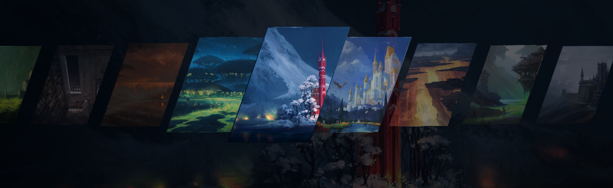

# Wallpaper Carousel

Based on the original wallpaper picker by [ilyamiro](https://github.com/ilyamiro/nixos-configuration).

A [DankMaterialShell](https://danklinux.com/) and [Noctalia](https://noctalia.dev/) plugin that lets you browse and pick wallpapers from a fullscreen skewed carousel overlay.




## About

Wallpaper Carousel scans your current wallpaper directory and displays all images in an animated 3D-skewed carousel. Navigate with keyboard or mouse, press Enter to apply. Thumbnails are pre-cached in memory at boot for instant opening.

This plugin integrates with all shell features — selecting a wallpaper updates the shell wallpaper, color scheme, and wallpaper animations configured in the shell.

https://github.com/user-attachments/assets/39bcde76-7d7b-40c0-a083-3b8961edf10b

## Credits

Original wallpaper picker by [ilyamiro](https://github.com/ilyamiro/nixos-configuration).

Wallpaper collection in the screenshot/video from [Andreas Rocha](https://www.andreasrocha.com/).


## Install

> **Note:** Your shell (Noctalia or DankMaterialShell) must be managing your wallpaper for this plugin to work. It does not work with external wallpaper engines (e.g. swww, swaybg, hyprpaper). Enable wallpaper management in DMS Settings → Wallpaper or Noctalia Settings → Wallpaper.

### Plugin manager (Dank Material Shell)

The plugin can be installed from the plugin browser in DankMaterialShell.

### Manual install

**DankMaterialShell**

1. Download the latest archive from the [Releases](../../releases) page
2. Extract it into your DMS plugins directory:
   ```sh
   tar xf wallpaperCarousel-*.tar.gz -C "${XDG_CONFIG_HOME:-$HOME/.config}/DankMaterialShell/plugins/"
   ```
3. Open DankMaterialShell Settings → Plugins and enable **Wallpaper Carousel**

**Noctalia v4**

1. Extract the archive into `${XDG_CONFIG_HOME:-$HOME/.config}/noctalia/plugins/`
2. Open Noctalia Settings → Plugins and enable **Wallpaper Carousel**

**Noctalia v5**

Noctalia v5 is a native C++ shell and no longer embeds Quickshell. `qs` (Quickshell ≥ 0.3) must be on your `PATH`.

1. Extract the archive into `${XDG_DATA_HOME:-$HOME/.local/share}/noctalia/plugins/`
   so that `plugin.toml` sits at
   `.../noctalia/plugins/wallpaperCarousel/plugin.toml`
2. Open Noctalia Settings → Plugins and enable **Wallpaper Carousel**
3. Toggle it from Control Center's shortcut grid, or bind a key (see below)

Settings live in Noctalia Settings → Plugins → Wallpaper Carousel. The overlay
process starts on first use; enable **Start With The Shell** if you would rather
pay that cost at login and have the first open be instant.

## IPC Commands

### DMS

Control the carousel via DMS IPC:

| Command                                   | Description                                       |
| ----------------------------------------- | ------------------------------------------------- |
| `dms ipc wallpaperCarousel toggle`        | Open or close the overlay                         |
| `dms ipc wallpaperCarousel open`          | Open the overlay                                  |
| `dms ipc wallpaperCarousel close`         | Close the overlay                                 |
| `dms ipc wallpaperCarousel cycleNext`     | Open (if closed) and highlight next wallpaper     |
| `dms ipc wallpaperCarousel cyclePrevious` | Open (if closed) and highlight previous wallpaper |

### Noctalia v4

Control the carousel via Quickshell IPC:

| Command                                                         | Description                                       |
| --------------------------------------------------------------- | ------------------------------------------------- |
| `qs -c noctalia-shell ipc call wallpaperCarousel toggle`        | Open or close the overlay                         |
| `qs -c noctalia-shell ipc call wallpaperCarousel open`          | Open the overlay                                  |
| `qs -c noctalia-shell ipc call wallpaperCarousel close`         | Close the overlay                                 |
| `qs -c noctalia-shell ipc call wallpaperCarousel cycleNext`     | Open (if closed) and highlight next wallpaper     |
| `qs -c noctalia-shell ipc call wallpaperCarousel cyclePrevious` | Open (if closed) and highlight previous wallpaper |

### Noctalia v5

Commands go to the plugin's service, which starts the overlay process on demand.
An optional trailing argument names the output to open on; without one the
focused output is used.

| Command                                                          | Description                                       |
| ---------------------------------------------------------------- | ------------------------------------------------- |
| `noctalia msg plugin yngwe/wallpaperCarousel:service all toggle` | Open or close the overlay                         |
| `noctalia msg plugin yngwe/wallpaperCarousel:service all open`   | Open the overlay                                  |
| `noctalia msg plugin yngwe/wallpaperCarousel:service all close`  | Close the overlay                                 |
| `noctalia msg plugin yngwe/wallpaperCarousel:service all next`   | Open (if closed) and highlight next wallpaper     |
| `noctalia msg plugin yngwe/wallpaperCarousel:service all prev`   | Open (if closed) and highlight previous wallpaper |

`cycleNext` and `cyclePrevious` are accepted as aliases for `next` and `prev`, so
keybindings carried over from the DMS/v4 builds keep working unchanged.
| `noctalia msg plugin yngwe/wallpaperCarousel:service all quit` | Shut the overlay process down |

**Keyboard shortcuts** (when open): `←` / `→` to navigate, `Enter` to apply, `Escape` to close.

## Example Compositor Keybindings

### Niri

In `~/.config/niri/config.kdl`:

```kdl
binds {
    // DankMaterialShell
    Mod+W { spawn "dms" "ipc" "wallpaperCarousel" "toggle"; }
    Mod+Shift+Right { spawn "dms" "ipc" "wallpaperCarousel" "cycleNext"; }
    Mod+Shift+Left { spawn "dms" "ipc" "wallpaperCarousel" "cyclePrevious"; }

    // Noctalia v5
    Mod+W { spawn "noctalia" "msg" "plugin" "yngwe/wallpaperCarousel:service" "all" "toggle"; }
    Mod+Shift+Right { spawn "noctalia" "msg" "plugin" "yngwe/wallpaperCarousel:service" "all" "next"; }
    Mod+Shift+Left { spawn "noctalia" "msg" "plugin" "yngwe/wallpaperCarousel:service" "all" "prev"; }
}
```

### Hyprland

In `~/.config/hypr/hyprland.conf`:

```ini
# DankMaterialShell
bind = SUPER, W, exec, dms ipc wallpaperCarousel toggle
bind = SUPER SHIFT, Right, exec, dms ipc wallpaperCarousel cycleNext
bind = SUPER SHIFT, Left, exec, dms ipc wallpaperCarousel cyclePrevious

# Noctalia v5
bind = SUPER, W, exec, noctalia msg plugin yngwe/wallpaperCarousel:service all toggle
bind = SUPER SHIFT, Right, exec, noctalia msg plugin yngwe/wallpaperCarousel:service all next
bind = SUPER SHIFT, Left, exec, noctalia msg plugin yngwe/wallpaperCarousel:service all prev
```
